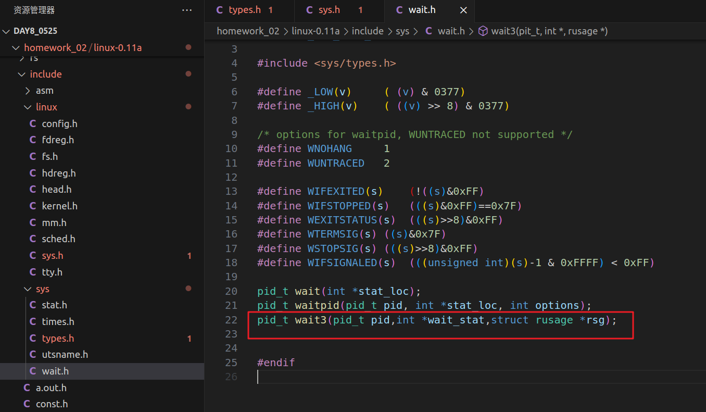

# 作业二 linux-0.11添加wait3（范文，utime和stime的取值有误，用了父进程）


## 1. 实验目的

熟悉并实践内核修改。 熟悉添加系统调用的方法。 

## 2. 实验内容 

增加系统调用 `wait3`，返回有进程运行时间。 

包括内核态运行，用户态和程序运行时间。

## 3. 步骤

### 3.1步骤一

在 `sched.h `中添加系统从开始到结束的宏定义


### 3.2 步骤二

在 `sys/types.h `中添加` rusage `结构体的定义


### 3.3 步骤三

在` include/sys.h` 中定义新的内核函数` sys_wait3()`。


### 3.4 步骤四

声明` wait3` 函数



### 3.5 步骤五

定义` wait3 `的函数内核号，操作系统使用内核函数号调用对应的函数


### 3.6 步骤六：

实现 `sys_wait3` 函数。详见 `kernel/exit.c`


### 3.7 步骤七：

系统调用值加 1


###  3.8 步骤八

增加 `wait3` 系统调用

 


### 3.9 步骤九：


`linux0.11 `只能使用老版本的 vi 编辑不方便编辑使用，可以使用 `mount` 命令把` linux0.11` 系统挂载到本地。

 1、在 Linux-0.11 文件夹下创建` share `文件夹

 2、执行命令:`sudo mount -o loop,offset=512 -t minix hdc-0.11.img  share/`


### 3.10 步骤十 编写 wait3_test.c ：

编写 `wait3_test.c `代码进行功能测试。以下是部分代码段，详见 具体代码` wait3_test.c`


### 3.11编译运行

```shell
make -C kernel
make
make start
```

## 4.遇到的问题


### 4.1 挂载镜像无权限

**解决办法**:修改权限

```
 1074  sudo chmod a+rwx share/
 1075  cd ..
 1076  sudo chmod a+rwx share/
 1077  cd share
 1078  sudo chmod a+rwx tmp/
```


### 4.2 编译报错

如在`wait3_test.c`添加` //` 注释无法编译，用中文无法编译等


**原因**：0.11很多语法老旧不兼容报错

**解决方法**：于是去掉注释，改为英文修改代码等

### 4.3 、用户态、内核态以及生命周期时间无法传回测试程序

**原因**因为系统调 用赋值的时候，是在内核态复制一份用户态数据

**解决办法**确保在系统调用中使用`put_fs_long`函数将内核态数据复制到用户态。


### 4.4 系统或者用户执行时间为0


**原因**执行时间太短

**解决方法**增加嵌套循环

```c++
//org     
for (i = 0; i < 100000000; i++); 


//now
		for (i = 0; i < 5000; i++){
            for ( i = 0; i < 1000; i++)
            {
                k++;
            }
        }
        for(i=0;i<100000;i++){
            time(&currentTime);
        }
```


## 5.结果展示

```shell
cd /tmp
gcc wait3_test.c -o wait3_test
./wait3_test
```

成功运行，输出如下：


